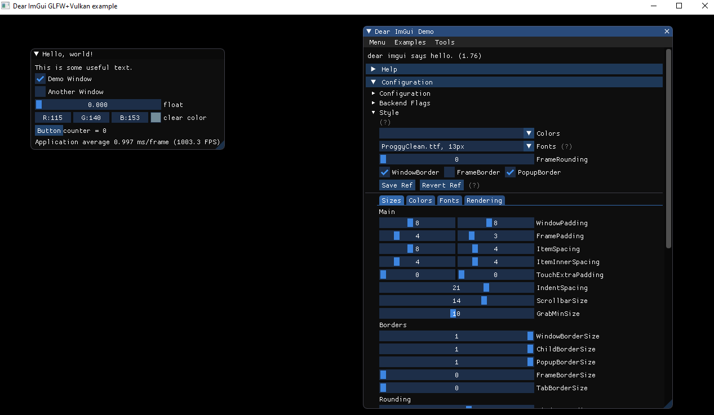

# vk-glfw-cimgui

Pure C demo for Vulkan, GLFW3 and CIMGUI.

This is the C port of IMGUI examples (https://github.com/ocornut/imgui/tree/master/examples/example_glfw_vulkan)

## Build

```sh
	# Debug (dist/Debug/...)
	make

	# Release (dist/Release/...)
	make CONF=Release
```

## Example



## Linker Libraries

-lvulkan-1 -lglfw3 -lcimgui -lstdc++ (needed for cimgui)

### Compile GLFW3 on Windows (MinGW via MSYS2)

```sh
	# Download sources from (https://www.glfw.org/download.html)
	cd glfw
	rm CMakeCache.txt
	cmake -DBUILD_SHARED_LIBS=OFF -DGLFW_BUILD_EXAMPLES=ON -DGLFW_VULKAN_STATIC=OFF -G "MinGW Makefiles"
	make install
```

### Compile CIMGUI on Windows (MinGW via MSYS2)

```sh
	git clone https://github.com/cimgui/cimgui.git
	cd cimgui
	rm CMakeCache.txt
	git submodule update --init --recursive
	cmake -DIMGUI_STATIC=ON -DCIMGUI_TEST=ON -G "MinGW Makefiles"
	make install
```
